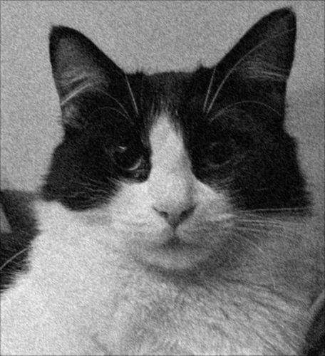
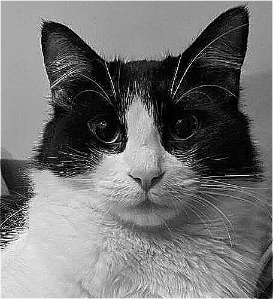
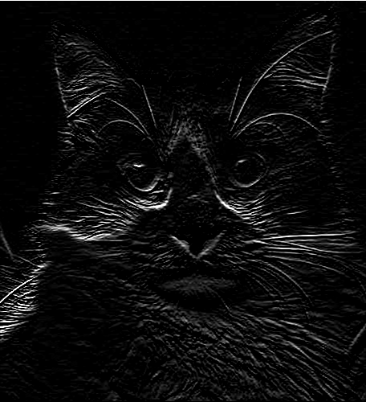

# NLA_CPP

This repository contains the code written by **Giulia Cavoletti**, **Francesco Paladini**, and **Paolo Potì** for the *Numerical Linear Algebra* course challenges at the **Politecnico di Milano**.

---

## Challenge 1: Image Filtering and Linear System Approximation

The goal of the first challenge is to:
- Apply image filters.
- Find the approximate solution of a linear system to process a greyscale image.

---

## Usage

Move to the `src` directory and compile `chal1_main.cpp` with:

```bash
g++ -I ${mkEigenInc} -I external/ chal1_main.cpp utils.cpp -o chal1
```

Then execute the program with

```bash
./chal1 ../images/uma.jpg
```

---

## Results
To complete the challenge we used the Eigen and LIS libraries to apply image filters and to solve linear systems.
By writing the convolution operations corresponding to the kernels as a matrix–vector product, we obtained different effects on images.  
We started with the original one and then added noise:


<table align="center" border="0">
  <tr>
    <td align="center">
      <br>
      <em>Original Image</em>
    </td>
    <td align="center">
      <br>
      <em>Noisy Image</em>
    </td>
  </tr>
</table>


We applied a smoothing kernel to the noisy image and a sharpening kernel to the original one:

$$
H_{av1} = \frac{1}{8} \begin{pmatrix}
1 & 1 & 0 \\
1 & 2 & 1 \\
0 & 1 & 1
\end{pmatrix}
\qquad
H_{sh1} = \begin{pmatrix}
0 & -2 & 0 \\
-2 & 9 & -2 \\
0 & -2 & 1
\end{pmatrix}
$$

We obtained the following images

<table align="center" border="0">
  <tr>
    <td align="center">
      <br>
      <em>Blurred Image</em>
    </td>
    <td align="center">
      <br>
      <em>Sharpened Image</em>
    </td>
  </tr>
</table>


Using the LIS library we also solved the linear system $A_2\mathbf{x}=\mathbf{w}$ where $A_2$ is the matrix that corresponds to $H_{sh1}$ and $\mathbf{w}$ is the noisy image represented as a vector. Since $A_2$ is SPD we used the Conjugate Gradient method. We exported $\mathbf{x}$ as .png:

<p align="center">
  <br>
    <em>Solution of the linear system</em>
</p>

We constructed a matrix $A_3$ that corresponded to the detection filter

$$
H_{ed2} = \begin{pmatrix}
-1 & -2 & -1 \\
0 & 0 & 0 \\
1 & 2 & 1
\end{pmatrix}
$$

and by applying it to the original image we obtained:

<p align="center">
  <br>
    <em>Image after edge detection</em>
</p>

Finally we used Eigen to compute the approximate solution to the linear system $(3I + A_3)\mathbf{y} = \mathbf{w}$, where $A_3$ is the matrix that corresponds to $H_{ed2}$:

<p align="center">
  <br>
    <em>Solution of the linear system</em>
</p>

## Challenge 2: Eigenvalue problems applied to clustering and social networks

The goal of the second challenge is to 
- Apply linear algebra techniques and eigensolvers to data clustering

## Usage

Move to the `src` directory and compile `chal2_main.cpp` with:

```bash
g++ -I ${mkEigenInc} chal2_main.cpp utils.cpp -o chal2
```

Then execute the program with

```bash
./chal2
```

## Results

We explored spectral clustering, a technique that partitions networks by analyzing the eigenvalues and eigenvectors of their associated matrices. We applied this strategy to two case studies: first, a small illustrative graph where the clustering can be visually verified, and second, a real-world Facebook friendship network containing 351 users

## Small Graph

First, we applied our clustering strategy to the graph shown in the picture below.


<p align="center">
    
</p>

We computed the Laplacian graph by performing :
$$ L_g = D_g - A_g $$
Where : 
- $A_g$ is the adjacency matrix of the graph
-  $D_g$ is is diagonal matrix with the vector $v_g$ on the main diagonal and zeros everywhere 
else.
- $v_g$ is a vector such that each component $v_i$ is the sum of the entries in the i-th
row of matrix $A_g$

We then computed the **Fiedler vector** which is the eigenvector corresponding to the second smallest eigenvalue of the Laplacian graph $L_g$

The Fiedler vector obtained for the small example is:

```
0.455542
0.391696
0.218053
0.391696
-0.190354
-0.308704
-0.340521
-0.308704
-0.308704
```

We computed this vector in two different ways : 

- We used the SelfAdjoint solver provived by the Eigen library to compute all the eiganvalue and eigenvector the we choose the second smallest 
- We constructed a new matrix B by deflating the matrix A, removing its smallest eigenvalue using a Householder transformation.


 
The Fiedler vector partitions the graph into two subgraphs, which, based on the sign of the entries, are formed by nodes **{1, 2, 3, 4}** and **{5, 6, 7, 8, 9}**.  
This result is consistent with the structure of the graph shown in the reference image.


## Facebook Community Graph

We then moved to the larger graph and performed the same strategy now using methods provived by the **LIS** library.  
We computed the **largest eigenvalue** of its Laplacian matrix using the  the LIS **Power Method** as an iterative solver.  
A **shift of 29.5** was chosen, as it provided the fastest convergence.

To compute the **second smallest eigenvalue**, we used the **Inverse Power Method** in LIS, specifying the option `-ss 2` to compute both of the two smallest eigenvalues.

---

## Clustering Results

By analyzing the sign of the entries in the eigenvector corresponding to the second smallest eigenvalue, we observed a clear partition into two clusters of sizes **52** and **299**, representing two distinct communities.

After constructing the **permutation matrix** and the **ordered adjacency matrix** $A_{\text{ord}}$
, we observed that the **off-diagonal blocks** of $A_{\text{ord}}$
 represent the **connections between the two clusters**.  
Therefore, we expected fewer nonzero elements in these blocks compared to the off-diagonal blocks of the **non-ordered** adjacency matrix $A_{\text{s}}$


This expectation was confirmed by our results:

- **332 nonzero elements** for $A_{\text{ord}}$

- **1162 nonzero elements** for $A_{\text{s}}$


This significant reduction indicates that the clustering strategy successfully separated the graph into two weakly connected communities.

---

## Visualization

Below are the sparsity patterns of the two matrices:


| social.mtx  | ordered.mtx |
|------------|----------|
|  |  |


## Off-diagonal matrices 

| social.mtx  | 
|------------|
| |

|ordered.mtx |
|----------|
  |

---

## Conclusion

The spectral clustering based on the Fiedler vector correctly identified two distinct communities in the network.  
The reduction of nonzero entries in the off-diagonal blocks of the reordered adjacency matrix confirms that the clusters are weakly connected, validating the effectiveness of the method.
